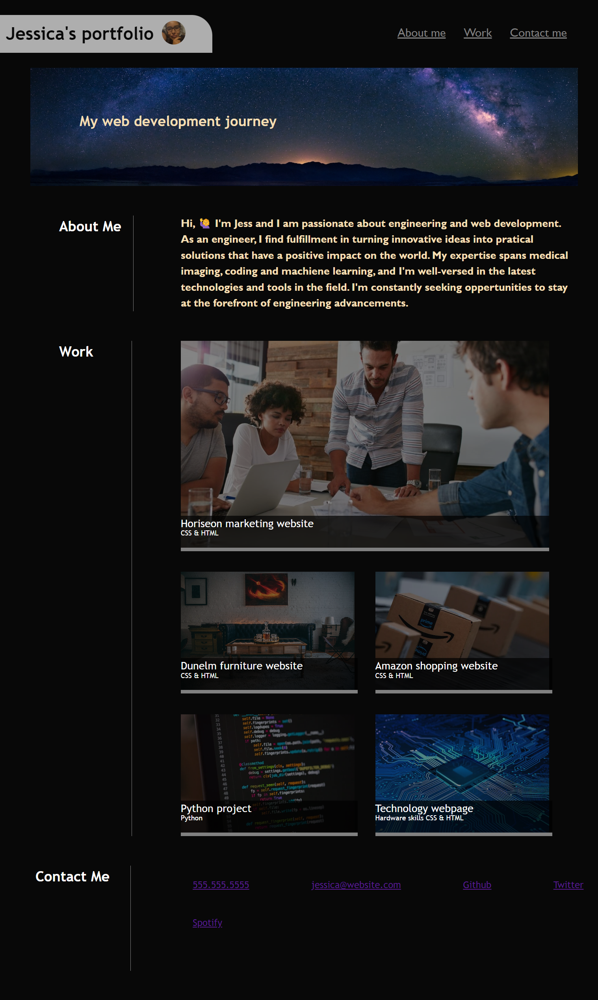
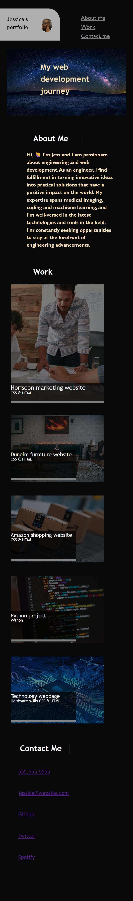

# Jess-portfolio
Portfolio of work 

## Descritption
This project is a website to show my portfolio of work. This project was built to become familiar with both flex and grid box, as well as to demonstrate my web development journey to future emplyees. During the course of this project the importance of grid and flex box was understood in order to develop interactive design layouts for web pages. 

## This project completed the following:  
* When the page is loaded the page presents my name, a recent photo, and links to sections about me, my work, and how to contact me
* When one of the links in the navigation is clicked then the UI scrolls to the corresponding section
* When viewing the section about my work then the section contains titled images of my applications
* When presented with the my first application then that application's image is larger in size than the others
* When images of the applications are clicked then the user is taken to that deployed application
* When the page is resized or viewed on various screens and devices then the layout is responsive and adapts to my viewport

### jessica's-portfolio Website view

### jessica's-portfolio mobile view

### Link to deployed application
Access the live application [here](https://jessi994.github.io/jess-portfolio/)

### Credits

N/A

### License

N/A
